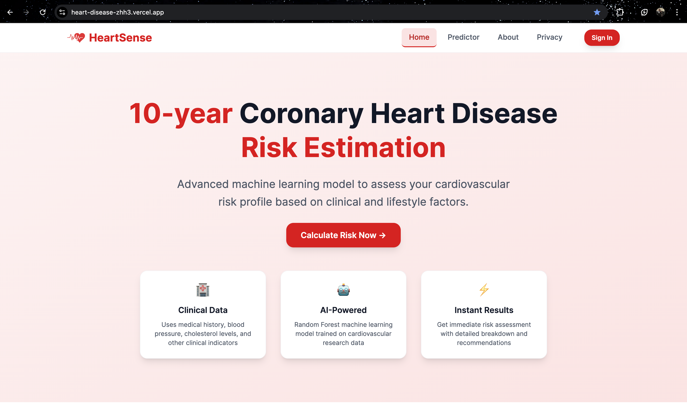
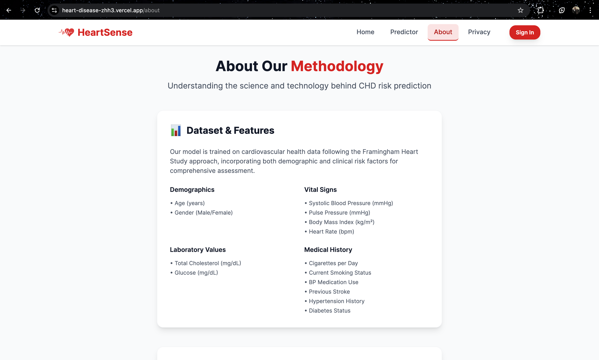
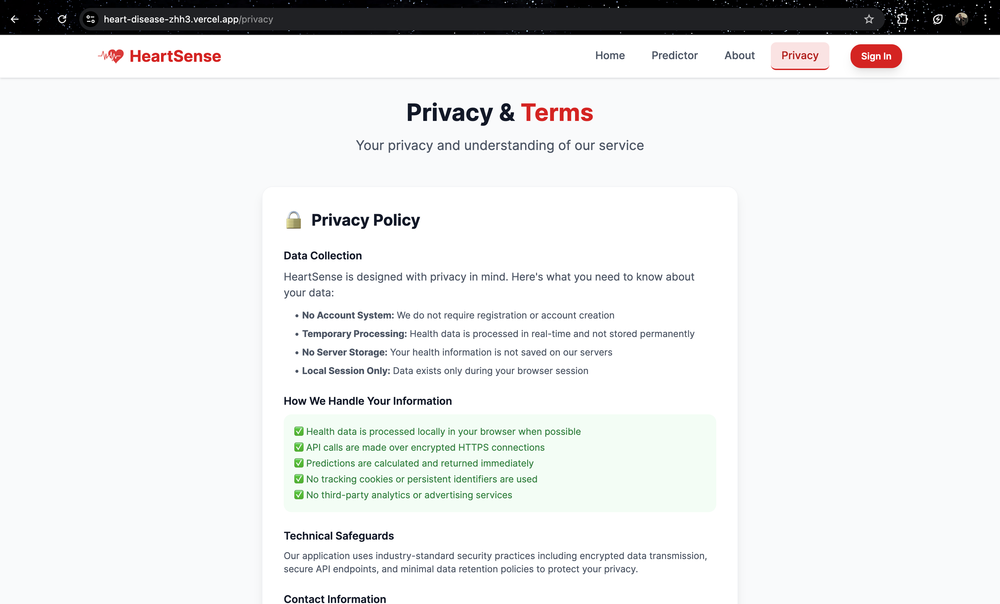
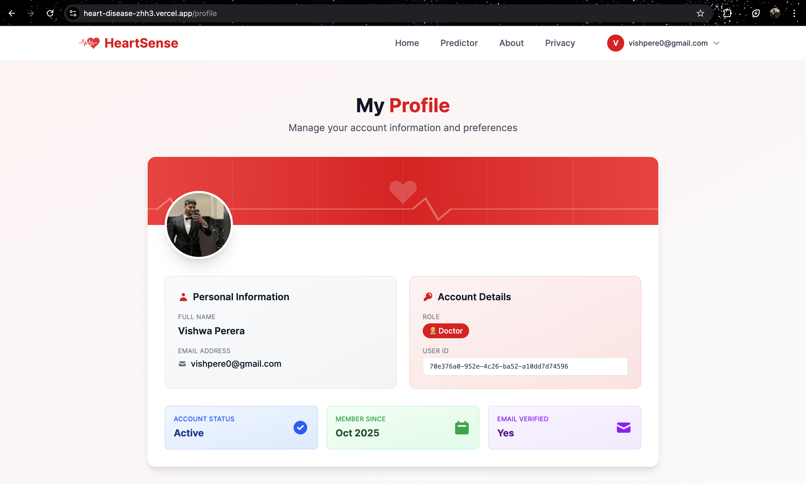
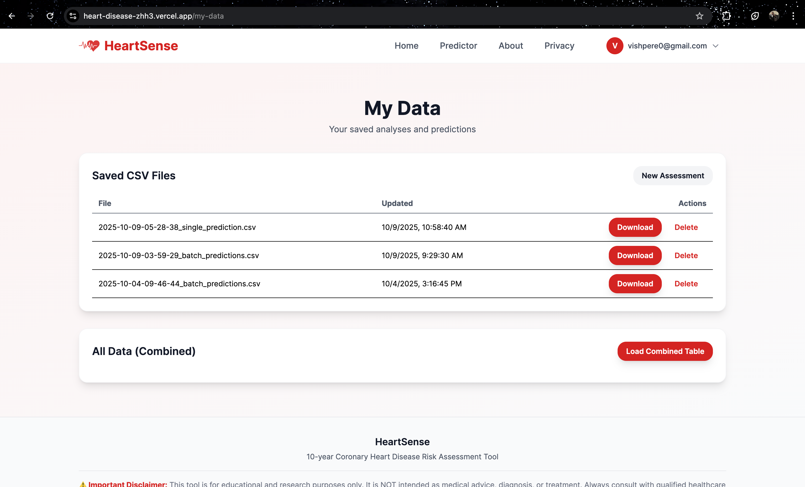
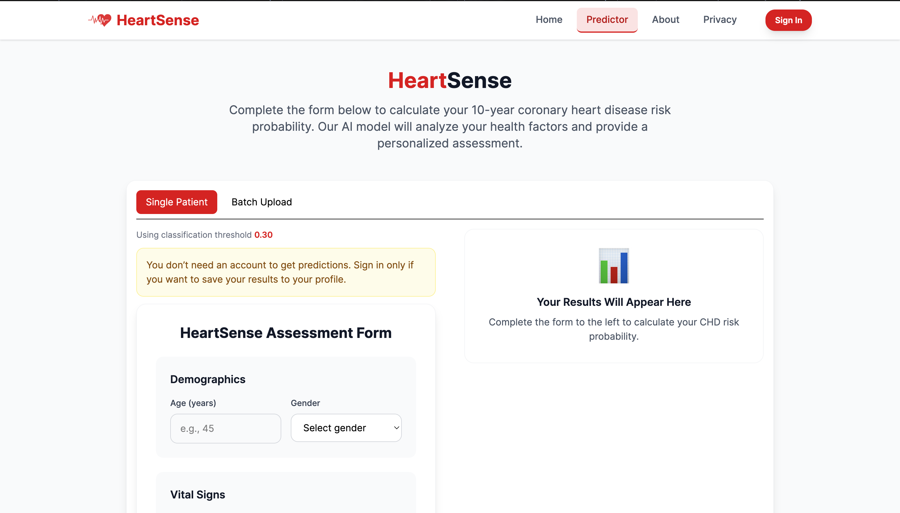
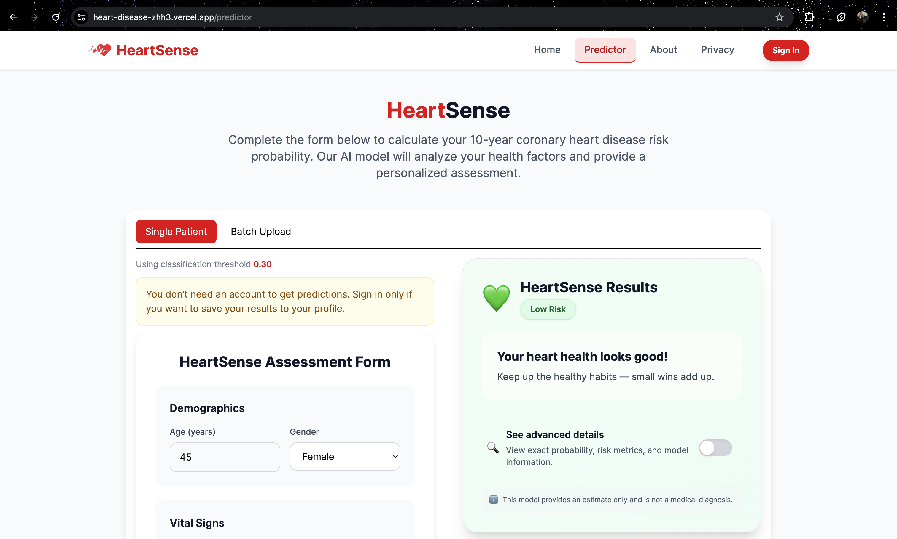

# HeartSense — 10‑Year CHD Risk Prediction

Human‑centered, interpretable risk screening for Coronary Heart Disease.

Built by the SYNCODE organization — Group 07 · https://github.com/SYNCODE-SLIIT

Live: https://heart-disease-zhh3.vercel.app/ · Demo: https://syncode-sliit-heart-disease-appstreamlit-app-featureprav-txhnms.streamlit.app/ · API: https://heart-disease-tbi9.onrender.com/

---

## Quick Links

- Website: https://heart-disease-zhh3.vercel.app/
- Streamlit Demo: https://syncode-sliit-heart-disease-appstreamlit-app-featureprav-txhnms.streamlit.app/
- API Base: https://heart-disease-tbi9.onrender.com/
- Org: https://github.com/SYNCODE-SLIIT

---

## Table of Contents

1. Project Objective
2. Problem Definition
3. Dataset
4. Data Preprocessing
5. Exploratory Data Analysis (EDA)
6. Modeling Approach
7. Evaluation Metrics
8. Interpretability
9. Software Architecture
10. Deployment
11. Local Development
12. Testing & Validation
13. Screenshots
14. Limitations & Future Work
15. Credits
16. License

---

## 1) Project Objective

- Predict 10‑year risk of coronary heart disease (CHD) using demographic, behavioral, and clinical data.
- Deliver interpretable predictions with key risk factors highlighted.
- Implement a lightweight software prototype (API + UI) for education and demonstration.

> Note: HeartSense is an educational prototype, not a diagnostic medical device.

---

## 2) Problem Definition

- CVD challenge: CHD can develop silently; early identification is critical.
- Traditional methods may miss at‑risk individuals or over‑refer low‑risk patients.
- Goal: Data‑driven, non‑diagnostic screening tool that predicts 10‑year CHD risk and surfaces contributing factors.
- Target variable: `TenYearCHD` (0 = No CHD in 10 years, 1 = CHD in 10 years).

---

## 3) Dataset

- Source: Kaggle – Cardiovascular Dataset (Sirplotsalot), adapted/expanded for this project.
- Size: ~11,000 rows × 16 columns.
- Features (human‑readable):
  - gender: Sex (Male/Female) – Categorical
  - age: Age (years) – Numeric
  - education: Education Level (1–4) – Ordinal
  - currentSmoker: Current Smoker – Binary
  - cigsPerDay: Cigarettes per Day – Numeric
  - BPMeds: On Blood Pressure Medication – Binary
  - prevalentStroke: History of Stroke – Binary
  - prevalentHyp: Hypertension Diagnosis – Binary
  - diabetes: Diabetes Diagnosis – Binary
  - totChol: Total Cholesterol – Numeric
  - sysBP: Systolic Blood Pressure – Numeric
  - diaBP: Diastolic Blood Pressure – Numeric
  - BMI: Body Mass Index – Numeric
  - heartRate: Resting Heart Rate – Numeric
  - glucose: Fasting Glucose – Numeric
  - TenYearCHD: 10‑Year CHD (Target) – Binary

Notes:
- The working dataset was expanded using realistic synthetic generation for diversity.
- Combines demographic, lifestyle, and clinical features, enabling multidimensional risk assessment.

---

## 4) Data Preprocessing (notebook/)

- Missing values: Median imputation for numeric; mode/most frequent for categorical/binary.
- Encoding: Keep categorical text for model pipeline to one‑hot; binaries as Yes/No → encoded by pipeline.
- Feature engineering: `pulsePressure = sysBP - diaBP` (clipped at 0).
- Scaling: Z‑score normalization for numeric features inside the pipeline.
- Class imbalance: Addressed via model choice and thresholding; can be extended with class weights/SMOTE.
- Collinearity checks: VIF used to drop redundant features (e.g., often drop `diaBP` when using pulse pressure).

Key notebooks:
- `notebook/preprocessing.ipynb` – EDA, correlations, pairplots, Cramér’s V for categorical associations, preprocessing.

---

## 5) Exploratory Data Analysis (EDA) – highlights

- Descriptive stats: Age distribution, BP averages, BMI range, smoker prevalence.
- Correlations: Age, BP, BMI, cholesterol, glucose correlate with CHD.
- Risk insights: Higher age, smoking, hypertension, obesity, elevated cholesterol/glucose → higher CHD risk probability.

---

## 6) Modeling Approach

- Problem: Binary classification (`TenYearCHD`).
- Candidates: Logistic Regression (interpretable), Random Forest (non‑linear), Gradient Boosting (XGBoost/LightGBM).
- Final API model: Scikit‑learn pipeline persisted with joblib; random forest/boosting oriented for robust performance.
- Strategy: Stratified train/test split; cross‑validation; thresholding to balance sensitivity/specificity.

---

## 7) Evaluation Metrics

- Primary: Recall (clinical sensitivity to identify at‑risk patients).
- Secondary: Precision, F1, ROC‑AUC, PR‑AUC.
- Model selection favors higher recall with reasonable precision.

---

## 8) Interpretability

- Probability output plus discrete label using a configurable threshold.
- Quick top‑factor hints for batch outputs (heuristic based on standardized magnitudes and categorical flags).
- SHAP analysis recommended (global + local) to explain feature contributions; can be added to pipeline for richer explanations.

---

## 9) Software Architecture

Monorepo layout:

- `backend/` – FastAPI service
  - Model artifacts: `backend/heart_rf_pipeline.pkl`, `backend/decision_threshold.json`
  - App code: `backend/app/main.py`, `backend/app/prepare.py`, `backend/app/schemas.py`, etc.
  - Settings: `backend/app/settings.py` (includes CORS settings and paths)
  - Endpoints:
    - `GET /` – health check
    - `GET /api/v1/meta` – model metadata, expected columns, threshold
    - `POST /api/v1/predict` – single prediction
    - `POST /batch` – JSON batch prediction
    - `POST /api/v1/batch` – JSON batch prediction (versioned)
    - `GET /batch/export` – export last batch results (CSV/XLSX)

- `chd-web/` – Next.js (TypeScript) frontend
  - Pages: risk predictor UI (`/predictor`)
  - Components: form, result card with “advanced details,” batch upload, auth helpers
  - Env var: `NEXT_PUBLIC_API_BASE` to point to Render API
  - Optional rewrites to proxy API via `/api/*`

- `app/` – Streamlit app (separate demo UI)

- `notebook/` – Jupyter notebooks for EDA and preprocessing

---

## 10) Deployment

- Frontend: Vercel (root directory set to `chd-web/`).
- Backend: Render (FastAPI, warm instance recommended for lower latency). Health endpoint `/`.
- Streamlit demo: Hosted separately (see link above).

Environment variables:
- On Vercel: `NEXT_PUBLIC_API_BASE=https://heart-disease-tbi9.onrender.com`
- On Render: CORS allowed origins must include your Vercel domain(s) with scheme, e.g. `https://your-app.vercel.app` and any custom domains.

---

## 11) Local Development

Prerequisites: Python 3.10+, Node.js 18+.

Backend (FastAPI):
- Create/activate a venv, then install:
  - `pip install -r backend/requirements.txt`
- Run locally:
  - `uvicorn app.main:app --reload --port 8000` (from `backend/`)
- Docs: `http://localhost:8000/docs`

Frontend (Next.js):
- From `chd-web/`:
  - `npm install`
  - Set `.env.local` with `NEXT_PUBLIC_API_BASE=http://localhost:8000`
  - `npm run dev` (http://localhost:3000)

Streamlit demo:
- From `app/`: `streamlit run streamlit_app.py`

---

## 12) Testing & Validation

- API contract tests (example in repo: `test_api.py`).
- Form validation: Required fields, numeric ranges; submit‑only errors for calmer UX.
- Manual acceptance: End‑to‑end from UI to API with real/synthetic inputs.

---

## 13) Screenshots

Below are key screens from the live website. All images are stored under `docs/images/`.

### Home

### About

### Privacy

### Profile

### My Data

### Predict Form

### Predict Result

—

## 14) Limitations & Future Work

- Real‑world deployment requires validation on hospital EHR data.
- No longitudinal/temporal features; uses baseline measurements.
- Future: what‑if simulation, mobile app, wearable/IoT integration, subgroup fairness, and full SHAP explanations in UI.

—

## 15) Credits

- Dataset: Kaggle Cardiovascular Dataset (Sirplotsalot), adapted.
- Libraries: FastAPI, scikit‑learn, pandas, NumPy, Next.js, Tailwind CSS, Streamlit.

—

## 16) License

This project is for educational and research purposes only and is not a medical device. Check repository license terms before reuse.
