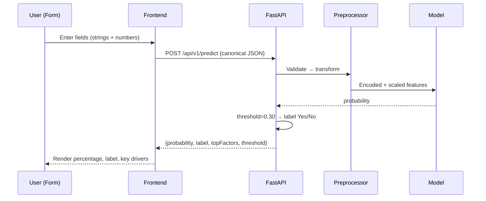

# HeartSense — Heart-Disease Risk Prediction Web App

An educational screening tool that estimates 10‑year coronary heart disease (CHD) risk with a trained ML pipeline. It supports:
- Single patient entry (form)
- Batch predictions (CSV/XLSX upload) with validation, normalization, preview, and export

Disclaimer: This app is for educational/research purposes only and is not a diagnostic device. Do not use for clinical decisions.

---

## 1) Executive Summary

Users enter patient data (Single) or upload a CSV/XLSX (Batch). The frontend normalizes inputs (Yes/No strings, gender, ranges), derives pulsePressure when needed, and sends canonical rows to the backend. The backend loads a saved sklearn Pipeline (preprocessor + classifier), returns probability and a label using a decision threshold (default 0.30), plus brief top-factor explanations. Results are displayed and can be exported.

One-screen flow:

```mermaid
flowchart LR
  UI[(Frontend\nSingle Form | CSV/XLSX)] --> V[Client Validation & Normalization\n- header mapping\n- type coercion\n- Yes/No strings\n- pulsePressure = sysBP - diaBP]
  V --> API[/FastAPI Backend/]
  API --> PP[Preprocessor (imputer + scaler + OHE)]
  PP --> Model[Classifier]
  Model --> Expl[Top Factors (heuristic/SHAP-ready)]
  Expl --> Resp{{JSON: probability, label, topFactors}}
  Resp --> UI
```

Single vs Batch use the same underlying model pipeline, ensuring parity and avoiding train–serve skew.

---

## 2) Architecture Overview

- Frontend: Next.js/React + TypeScript (see `chd-web/package.json` for exact versions)
  - CSV parsing: PapaParse
  - XLSX parsing: SheetJS
  - Client-side normalization: header alias mapping, Yes/No and gender normalization, numeric coercion, range checks, optional pulsePressure derivation
- Backend: FastAPI (see `backend/requirements.txt` for versions)
  - Loads `heart_rf_pipeline.pkl` (sklearn Pipeline: ColumnTransformer preprocessor + classifier)
  - Endpoints: `/api/v1/predict` (single JSON), `/api/v1/batch` (batch JSON)
  - Decision threshold: default 0.30, read from `backend/decision_threshold.json` (see Configuration)

> Educational use only — not a medical device.

---

## 3) File/Folder Map (Auto‑discovered)

Project tree (selected, depth ≤ 3):

```
Heart-Disease/
  README.md                      # Existing project readme (unchanged)
  README_WEBAPP.md               # This file
  requirements.txt               # Root requirements (if any)
  test_api.py                    # API tests (sample)
  app/                           # (Streamlit demo)
  backend/
    decision_threshold.json      # Default decision threshold config
    heart_rf_pipeline.pkl        # Canonical production model (sklearn Pipeline)
    requirements.txt             # Backend deps
    app/
      __init__.py
      main.py                    # FastAPI app, endpoints, model load
      prepare.py                 # (Used by file-upload flow) canonicalization/prepare helpers
      schemas.py                 # Pydantic schemas (single + batch)
      schema_specs.py            # Canonical columns, ranges, alias specs
      settings.py                # App settings
      batch_cache.py             # Cache for file-upload flow
  chd-web/
    package.json                 # Frontend deps (Next.js/React)
    src/
      pages/
        predictor.tsx            # Single vs Batch tabs UI
        about.tsx, privacy.tsx   # Informational pages
      components/
        BulkPredictPanel.tsx     # Batch workflow: upload→normalize→preview→predict→export
      lib/
        batchNormalize.ts        # Header mapping, normalization, PP derivation, checks
    public/
      heartsense_template.csv    # Canonical CSV template
  data/                          # Sample datasets
  model_artifacts/
    decision_threshold.json      # Another copy (not used by backend unless configured)
    heart_rf_pipeline.pkl        # Backup of model artifact
  notebook/
    preprocessing.ipynb          # EDA/training-time preprocessing design
    compare_api_vs_model.ipynb   # Parity checks: direct vs API predictions
    preprocessor.joblib          # Fitted ColumnTransformer (training utility)
    splits.joblib                # Train/test split (training utility)
```

Roles & Responsibilities:
- `backend/app/main.py`: FastAPI routes, model loading, inference, thresholding, top-factor stubs
- `backend/app/schemas.py`: Pydantic models for request/response (single and batch JSON)
- `backend/app/prepare.py`: Utilities used by file-upload batch flow (header canonicalization)
- `backend/app/schema_specs.py`: Canonical column list, alias/range definitions
- `chd-web/src/components/BulkPredictPanel.tsx`: Batch UI, calls `/api/v1/batch`
- `chd-web/src/lib/batchNormalize.ts`: Client-side parsing, normalization, pulsePressure derivation
- Artifacts: `backend/heart_rf_pipeline.pkl` is the production model; notebooks contain training utilities

Config knobs:
- Decision threshold: `backend/decision_threshold.json`
- API base URL: `chd-web/.env.local` → `NEXT_PUBLIC_API_BASE`
- Model path: expected in `backend/heart_rf_pipeline.pkl`

---

## 4) Environment & Quick Start

Backend (FastAPI):

```bash
# macOS/Linux
cd backend
python3 -m venv .venv
source .venv/bin/activate
pip install -r requirements.txt
uvicorn app.main:app --reload --port 8000
```

Frontend (Next.js):

```bash
cd chd-web
cp .env.local.example .env.local  # if provided; otherwise create .env.local
# ensure NEXT_PUBLIC_API_BASE matches backend (e.g., http://127.0.0.1:8000)
npm install
npm run dev
# open http://127.0.0.1:3000
```

Model artifact:
- Backend expects `backend/heart_rf_pipeline.pkl` at startup. If you move it, update the loader path in `backend/app/main.py`.

Health check:
- Open `http://127.0.0.1:8000/docs` for API docs after backend starts.

---

## 5) Data Contract (Single & Batch)

Categoricals must be strings matching training-time values (no booleans or 1/0):
- Categorical (strings): `gender` ∈ {"Male","Female"}, `currentSmoker`,`BPMeds`,`prevalentStroke`,`prevalentHyp`,`diabetes` ∈ {"Yes","No"}
- Numerics: `age`, `cigsPerDay`, `totChol`, `sysBP`, `BMI`, `heartRate`, `glucose`, `pulsePressure`
- Derived: If `pulsePressure` missing but `diaBP` present, compute `pulsePressure = sysBP - diaBP` on the client and omit `diaBP` from payload.

Header synonyms (case-insensitive; whitespace/underscore/hyphen differences ignored):
- `gender` ← sex, gndr, m/f, is_male
- `currentSmoker` ← smoker, smoking, is_smoker
- `BPMeds` ← bp_meds, on_bp_meds, antihypertensives
- `prevalentStroke` ← stroke, prior_stroke
- `prevalentHyp` ← hypertension, high_bp, htn
- `diabetes` ← diabetic, dm
- `age` ← years
- `cigsPerDay` ← cigarettes_per_day, cigs_day
- `totChol` ← total_cholesterol, chol_total
- `sysBP` ← systolic_bp, sbp
- `BMI` ← body_mass_index
- `heartRate` ← pulse, bpm
- `glucose` ← fasting_glucose, fbg
- `pulsePressure` ← pp, sbp_dbp_diff
- frontend-only: `diaBP` ← dbp, diastolic_bp (used only to compute `pulsePressure`)

Ranges (warn if out-of-range; error if nonsensical):
- age 18–95, cigsPerDay 0–60, totChol 80–500, sysBP 70–260, BMI 10–80, heartRate 30–240, glucose 40–600, pulsePressure 10–120.

Validation checklist (Batch):
- Header normalization → canonical names
- Required columns resolvable (PP or (sysBP+diaBP))
- Extra columns ignored with notice
- Type coercion and range checks
- Categorical normalization to {Yes, No} and gender to {Male, Female}
- Row-level warnings/errors collected; preview cleaned grid

Single example (JSON):
```json
{
  "gender": "Male",
  "currentSmoker": "No",
  "BPMeds": "Yes",
  "prevalentStroke": "No",
  "prevalentHyp": "Yes",
  "diabetes": "No",
  "age": 54,
  "cigsPerDay": 10,
  "totChol": 240,
  "sysBP": 140,
  "BMI": 28.4,
  "heartRate": 78,
  "glucose": 110,
  "pulsePressure": 60
}
```

Batch example (JSON body for `/api/v1/batch`):
```json
{
  "rows": [ { /* canonical row as above */ } ],
  "threshold": 0.30
}
```

---

## 6) Preprocessing Pipeline (What Actually Runs)

Based on `notebook/preprocessing.ipynb` and the saved pipeline `heart_rf_pipeline.pkl`:

1. Feature engineering
   - If present during cleaning: derive `pulsePressure = sysBP - diaBP`. Drop `diaBP` before model.
2. Missing values
   - Numeric: `SimpleImputer(strategy="median")`
   - Categorical: `SimpleImputer(strategy="most_frequent")`
3. Encoding
   - `OneHotEncoder(handle_unknown="ignore", drop="if_binary")` for categorical strings.
   - Important: Keep `Yes/No` and `Male/Female` as strings; do not convert to 1/0.
4. Scaling
   - `StandardScaler` for numeric features.
5. Model inference
   - Pipeline: `(preprocessor → classifier)` from `heart_rf_pipeline.pkl`
6. Thresholding
   - Default `0.30`. Backend reads from `backend/decision_threshold.json` and returns it in responses.
7. Explanations
   - Top factors: currently a fast heuristic; SHAP can be integrated later for exact attributions.

Differences from high-level design (called out):
- The design mentions an Alcohol feature with an "Unknown" bucket and ordinal levels (Low/Med/High). The current code/artifacts do not include Alcohol nor ordinal encoding; binary categoricals remain strings and are OneHotEncoded.

Summary table:

| Step | Module/Class |
| ---- | ------------- |
| Missing (num) | `sklearn.impute.SimpleImputer(median)` |
| Missing (cat) | `sklearn.impute.SimpleImputer(most_frequent)` |
| Encoding | `sklearn.preprocessing.OneHotEncoder(ignore, drop='if_binary')` |
| Scaling | `sklearn.preprocessing.StandardScaler` |
| Pipeline | `sklearn.pipeline.Pipeline` (with `ColumnTransformer`) |
| Artifact | `backend/heart_rf_pipeline.pkl` |

---

## 7) Request Lifecycle — End‑to‑End Sequence

A. Single Patient (POST `/api/v1/predict`)



B. Batch (POST `/api/v1/batch`)

```mermaid
sequenceDiagram
  participant U as User (CSV/XLSX)
  participant F as Frontend
  participant B as FastAPI
  participant P as Preprocessor
  participant M as Model
  U->>F: Drag & drop or choose file
  F->>F: Parse (PapaParse/SheetJS)
  F->>F: Map headers → canonical; normalize values; PP = sysBP - diaBP
  F->>U: Preview cleaned rows
  U->>F: Run predictions (threshold=0.30)
  F->>B: POST /api/v1/batch {rows[], threshold}
  B->>P: Validate → transform
  P->>M: Encoded + scaled features
  M-->>B: probabilities[]
  B->>B: threshold → labels + topFactors per row
  B-->>F: {results[], warnings, errors}
  F-->>U: Results table + Download CSV/XLSX
```

Note: A legacy file-upload flow exists at `/batch/predict` with server-side export endpoints; the JSON batch path `/api/v1/batch` is the recommended flow used by the current UI.

---

## 8) API Reference

Single prediction
- Path: `POST /api/v1/predict`
- Content-Type: `application/json`
- Request example:
```json
{
  "gender": "Female",
  "currentSmoker": "No",
  "BPMeds": "No",
  "prevalentStroke": "No",
  "prevalentHyp": "No",
  "diabetes": "No",
  "age": 32,
  "cigsPerDay": 0,
  "totChol": 175,
  "sysBP": 112,
  "BMI": 22.4,
  "heartRate": 68,
  "glucose": 88,
  "pulsePressure": 38
}
```
- Response 200:
```json
{
  "probability": 0.085,
  "label": "No",
  "threshold": 0.30,
  "topFactors": [
    {"feature":"age","direction":"+","impact":0.03},
    {"feature":"sysBP","direction":"+","impact":0.02},
    {"feature":"currentSmoker","direction":"+","impact":0.01}
  ]
}
```

Batch prediction (JSON)
- Path: `POST /api/v1/batch`
- Content-Type: `application/json`
- Request example:
```json
{
  "rows": [ { /* canonical row */ } ],
  "threshold": 0.30
}
```
- Response 200:
```json
{
  "count": 1,
  "results": [
    {
      "rowIndex": 0,
      "probability": 0.47,
      "label": "Yes",
      "topFactors": [
        {"feature":"pulsePressure","direction":"+","impact":0.12},
        {"feature":"totChol","direction":"+","impact":0.09},
        {"feature":"BPMeds","direction":"-","impact":0.05}
      ],
      "messages": []
    }
  ],
  "warnings": [],
  "errors": []
}
```

Sample curl (Single):
```bash
curl -sS -X POST "$NEXT_PUBLIC_API_BASE/api/v1/predict" -H "Content-Type: application/json" -d '{
  "gender":"Male","currentSmoker":"Yes","BPMeds":"No","prevalentStroke":"No","prevalentHyp":"Yes","diabetes":"No",
  "age":52,"cigsPerDay":5,"totChol":215,"sysBP":135,"BMI":27.8,"heartRate":74,"glucose":102,"pulsePressure":48
}'
```

Sample curl (Batch JSON):
```bash
curl -sS -X POST "$NEXT_PUBLIC_API_BASE/api/v1/batch" -H "Content-Type: application/json" -d '{
  "rows":[
    {"gender":"Male","currentSmoker":"No","BPMeds":"Yes","prevalentStroke":"No","prevalentHyp":"Yes","diabetes":"No",
     "age":54,"cigsPerDay":10,"totChol":240,"sysBP":140,"BMI":28.4,"heartRate":78,"glucose":110,"pulsePressure":60}
  ],
  "threshold":0.30
}'
```

Performance guidance:
- Single: typically < 100 ms after warm-start
- Batch: aim < ~5,000 rows per request; chunk larger files

---

## 9) Frontend UX Details

- Predictor page: tabs for “Single” and “Batch”.
- Single: fields map 1:1 to backend keys; categoricals are string selects; optional diaBP for PP derivation.
- Batch: drag & drop CSV/XLSX → alias mapping → normalization → preview → predict → results table → big red Download (CSV/XLSX). Reset button clears for a new file.
- Accessibility: keyboard focus for tabs/menus, `aria-*` on interactive elements, visible focus rings. Responsive tables with horizontal scroll.

---

## 10) Configuration & Tuning

- Frontend (`chd-web/.env.local`)
  - `NEXT_PUBLIC_API_BASE=http://127.0.0.1:8000`
- Backend
  - Model path: `backend/heart_rf_pipeline.pkl` (adjust in `app/main.py` if changed)
  - Decision threshold file: `backend/decision_threshold.json` (backend reads this at startup/first use)
    - Example:
      ```json
      { "threshold": 0.30 }
      ```
  - CORS: configure allowed origins if serving frontend from a different domain
- Explanations
  - SHAP integration can be enabled server-side (higher latency). Default is a fast top-factor heuristic.

---

## 11) Testing the App

Unit tests (suggested):
- Model load & health: ensure `heart_rf_pipeline.pkl` loads; preprocessor fields match expectations
- Schema validators (Pydantic): reject extras/missings; enforce types
- Alias mapper: synonyms → canonical keys
- Normalizers: Yes/No & gender normalization to strings; numeric coercion
- PulsePressure derivation and PP-vs-(sysBP-diaBP) consistency checks
- Thresholding: label flips when changing threshold across probability

Integration tests:
- Single happy path (200, plausible probability, label consistent with threshold)
- Batch happy path (predictions for all rows; row messages present)
- Synonym robustness (m/f, y/n, 1/0 normalized back to strings)
- sysBP+diaBP only → PP derived; diaBP omitted from payload
- sysBP+diaBP+PP mismatch → blocked with message
- Out-of-range numeric → warning, still processed
- Extra columns → ignored with notice

Manual QA:
- Use `notebook/compare_api_vs_model.ipynb` to ensure parity between direct model and API.
- Compare UI preview of cleaned rows with exported CSV.

---

## 12) Troubleshooting & FAQ

- Notebook vs Web probability mismatch
  - Ensure both use the same artifact (`heart_rf_pipeline.pkl`).
  - Do NOT send 1/0 or booleans for categoricals; send strings (`Yes`/`No`, `Male`/`Female`).
  - Confirm same threshold (default 0.30) and scaling/imputation.
  - Maintain the expected raw input columns (`preprocessor.feature_names_in_`).

- 405 on `/api/v1/batch`
  - Use POST (not GET). Verify path and Content-Type.

- CSV/XLSX parsing issues
  - Remove BOM; ensure consistent delimiters/quotes; avoid embedded units in cells; SheetJS sheet selection for multi-sheet files.

- Pulse Pressure consistency error
  - If both PP and diaBP provided and `abs(PP - (sysBP - diaBP)) > 2`, fix inputs or provide only sysBP+diaBP so the UI computes PP.

---

## 13) Deployment Notes

- Dev vs Prod
  - Serve backend behind a reverse proxy; enable CORS for the frontend domain.
  - Log the model path and threshold at startup.
- Containers
  - Use a slim Python image with required native libs for sklearn (and SHAP if enabled).
- Health checks
  - Expose `/docs` or a lightweight `/health` endpoint.
- Privacy
  - Avoid persisting uploaded data; redact logs; no PHI storage.

---

## 14) Change Log & Ownership

- Artifacts
  - `heart_rf_pipeline.pkl`: canonical production pipeline (preprocessor + classifier)
  - `preprocessor.joblib`, `splits.joblib`: training/notebook utilities (not used in inference)
  - `model.joblib` (if present): alternative saved pipeline; standardize on one to avoid drift
- Versioning
  - Bump model version when retraining; document `feature_names_in_`.
  - Prefer route versioning (`/api/v1/*`) for contract stability.
- Contacts
  - Backend/API owner, Frontend/UX owner, Model/DS owner

---

## Acceptance Checklist

- [x] File tree + per-file responsibilities
- [x] Precise Single & Batch data contracts (with aliases and required fields)
- [x] Preprocessing pipeline mapped to the actual code (with differences from design)
- [x] `/predict` and `/batch` endpoint docs with examples
- [x] End-to-end sequence diagrams (both flows)
- [x] Threshold (0.30) documented & how to change it
- [x] Feature contribution explanation surfaced
- [x] Error handling & validation notes
- [x] Run, test, deploy instructions
- [x] Troubleshooting (probability mismatch, CSV issues, 405)
